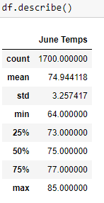

# Analysis of Hawaii Weather Data using Python libraries (Pandas and SQLAlchemy ORM), Flask, and SQLite

## Overview

The purpose of this project was to analyze past weather data for the city of Oahu, Hawaii at the request of a potential investor. The investor wanted to know if the location's weather (specifically precipitation amounts and temperatures) would be suitable. A concern was the amount of rain and how that may impact business. Analytics were then run on the weather data set for Oahu. This involved reading a dataset and connecting to a local database (SQLite). Jupyter Notebook, VS Code, and Git were the applications used. The analysis was completed with Python, using several libraries (SQLAlchemy, Pandas, Numpy, Matplotlib, Flask). The data was filtered, plotted, and summary statistics were calculated. A Flask application was created with several routes which can be used to access the specifical weather data for the location for the desired year/months. For this analysis, I created additional querys to filter the SQLite tables to return weather data for the months of June and December which can be used to compare the data at different times of the year.

## Results

### Three Differences between June and December Weather

Please see below SQLAlchemy query which returns the summary statistics for the month of June:

Please see below summary statistics for June:

Please see below summary statistics for December: *note - a similar query to the one listed above was used

1. The statistics indicate that there were more values (temperature readings) collected for the month of June than December. 

2. The month June has an average temperature which is approx. 3 degrees warmer than the month of December. As expected, June also has a higher maximum and minimum temperature reading. 

3. The calculated standard deviation for June is less than that of December. This, in turn, means the June temperatures have a smaller amount of variation and are relatively closer to the calculated average temperature. 

## Summary

Oahu, Hawaii seems to be a very good choice for a new business. This analysis supports that by revealing the average precipitation amount (.17") per reading, with 75% of the readings being < .13". The temperature analysis for June and December also show favorable average temperatures for both months revealing the temperature stays relatively consistent throughout the year.

### Two Additional Queries

1. `session.query(Measurement.prcp).filter(extract('month', Measurement.date) == 6)` 

This query would return the precpitation data for the month of June. A similary query could be run for December, which would allow for a comparison of precipitation amounts for June vs December. These results could then be loaded in to separate DataFrames where more analysis can take place.

2. `for i in range(1,13):`  
        `result = session.query(func.min(Measurement.tobs).filter(Measurement.station == 'USC00519281').filter(extract('month', Measurement.date) == i)).all()`

This query would return the minimum temperature recorded for each month of the year. This could be a useful query to dive deeper in to how the temperature fluctuates. 